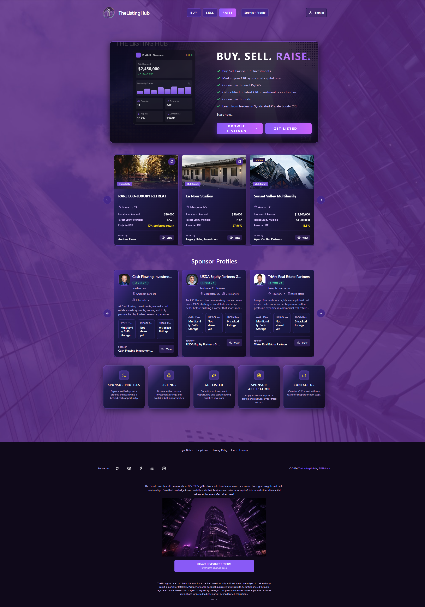

# TheListingHub — Portfolio Rebuild

Modern rebuild of a live CRE investment classifieds platform — Next.js 16, Supabase, Stripe Checkout (test mode), and motion UX.

| | |
|---|---|
| **Live demo** | [thelistinghub-demo.netlify.app](https://thelistinghub-demo.netlify.app) |
| **Original site** | [thelistinghub.com](https://thelistinghub.com/) |
| **Repo** | [github.com/nickgriff99/preishare-project](https://github.com/nickgriff99/preishare-project) |

> **Stripe:** This demo uses **Stripe test mode only**. No real charges. Use test card `4242 4242 4242 4242` (any future expiry, any CVC) to walk through checkout on the live URL.

## Project context

This is an **independent redesign concept** inspired by [thelistinghub.com](https://thelistinghub.com/) — **not affiliated with, endorsed by, or deployed on behalf of TheListingHub**. It exists as a portfolio piece demonstrating full-stack implementation against real product requirements.

**What this demo proves:**

- Rebuilt marketing + listings UX with Framer Motion and Tailwind v4
- Supabase Auth (email + Google), RLS, and PostgreSQL persistence
- Stripe Checkout Sessions + signed webhooks → `listing_payments` table
- Auth-gated catalog, express interest, account profile, and sponsor checkout flow

## Before / after

| Before ([thelistinghub.com](https://thelistinghub.com/)) | After (this rebuild) |
|---|---|
|  |  |


## Stack

- **Next.js 16** (App Router) + React 19 + TypeScript
- **Tailwind CSS v4** + Framer Motion
- **Supabase** — Auth (Google + email), PostgreSQL, RLS
- **Stripe** — Checkout Sessions + webhooks (**test mode**)
- **Netlify** — deployment

## Quick start (local)

```bash
npm install
cp .env.example .env.local
# Fill in Supabase + Stripe test keys (see below)
npm run dev
```

Open [http://localhost:3000](http://localhost:3000).

Without Supabase credentials, the app runs in **demo mode** with seeded listing data from `lib/listing-constants.ts`.

## Supabase setup

1. Create a project at [supabase.com](https://supabase.com)
2. Apply migrations:

   ```bash
   npx supabase link --project-ref YOUR_REF
   npx supabase db push
   npx supabase db seed
   ```

   Or run these in the SQL editor:
   - [`supabase/migrations/20250604000000_initial_schema.sql`](supabase/migrations/20250604000000_initial_schema.sql)
   - [`supabase/migrations/20250610000000_listing_payments.sql`](supabase/migrations/20250610000000_listing_payments.sql)
   - [`supabase/seed.sql`](supabase/seed.sql)

3. Enable **Google** auth in Authentication → Providers
4. Set redirect URLs:
   - `http://localhost:3000/auth/callback`
   - `https://YOUR-SITE.netlify.app/auth/callback`

## Stripe setup (test mode only)

1. Use **test** keys from [dashboard.stripe.com/test/apikeys](https://dashboard.stripe.com/test/apikeys) — `sk_test_...` and `pk_test_...`
2. Add to `.env.local` (never commit real keys)
3. Local webhooks:

   ```bash
   stripe listen --forward-to localhost:3000/api/webhooks/stripe
   ```

   Copy the signing secret to `STRIPE_WEBHOOK_SECRET`.

4. Production webhook (after Netlify deploy):
   - URL: `https://YOUR-SITE.netlify.app/api/webhooks/stripe`
   - Events: `checkout.session.completed`, `checkout.session.expired`

**Test card:** `4242 4242 4242 4242`

## Environment variables

| Variable | Required | Description |
|----------|----------|-------------|
| `NEXT_PUBLIC_SUPABASE_URL` | Yes (prod) | Supabase project URL |
| `NEXT_PUBLIC_SUPABASE_ANON_KEY` | Yes (prod) | Supabase anon key |
| `NEXT_PUBLIC_SITE_URL` | Yes (prod) | Your Netlify URL, e.g. `https://thelistinghub-demo.netlify.app` |
| `NEXT_PUBLIC_DEMO_MODE` | Yes (prod) | Set `true` to show portfolio banner on live site |
| `SUPABASE_SERVICE_ROLE_KEY` | Yes (prod) | Server-only — Stripe webhooks |
| `STRIPE_SECRET_KEY` | Yes (prod) | Stripe **test** secret key (`sk_test_...`) |
| `STRIPE_WEBHOOK_SECRET` | Yes (prod) | Stripe webhook signing secret |
| `NEXT_PUBLIC_STRIPE_PUBLISHABLE_KEY` | Optional | Stripe test publishable key |

See [`.env.example`](.env.example) and the full walkthrough in [docs/DEPLOY.md](docs/DEPLOY.md).

## Routes

| Route | Description |
|-------|-------------|
| `/` | Marketing home |
| `/listings` | Catalog (auth when Supabase configured) |
| `/listings/[slug]` | Listing detail + express interest |
| `/login` | Sign in / sign up |
| `/account` | Profile settings (authenticated) |
| `/get-listed` | Sponsor listing checkout — $499 test mode (authenticated) |
| `/get-listed/success` | Post-checkout confirmation |
| `/pricing` | Pricing plans |
| `/contact` | Contact form |

## Deploy

**Full step-by-step:** [docs/DEPLOY.md](docs/DEPLOY.md)

Summary: push to GitHub → connect repo in Netlify → set env vars → apply Supabase migration → register Stripe test webhook → run smoke tests from [docs/MVP_LAUNCH_CHECKLIST.md](docs/MVP_LAUNCH_CHECKLIST.md).

## Demo script (2 minutes for recruiters)

1. Open live Netlify URL → home + featured listings
2. **Sign in** (Google or email) → header shows name + sign out
3. `/listings` → open a deal → **Express interest** (writes to Supabase)
4. `/pricing` → **Get your deal listed** → `/get-listed`
5. Pay with test card `4242 4242 4242 4242` → success page
6. Optional: show Supabase `listing_interests` + `listing_payments` rows

## Scripts

```bash
npm run dev       # Development
npm run build     # Production build
npm run lint      # ESLint
npm run typecheck # TypeScript
```

## License

Private — portfolio demonstration project.
